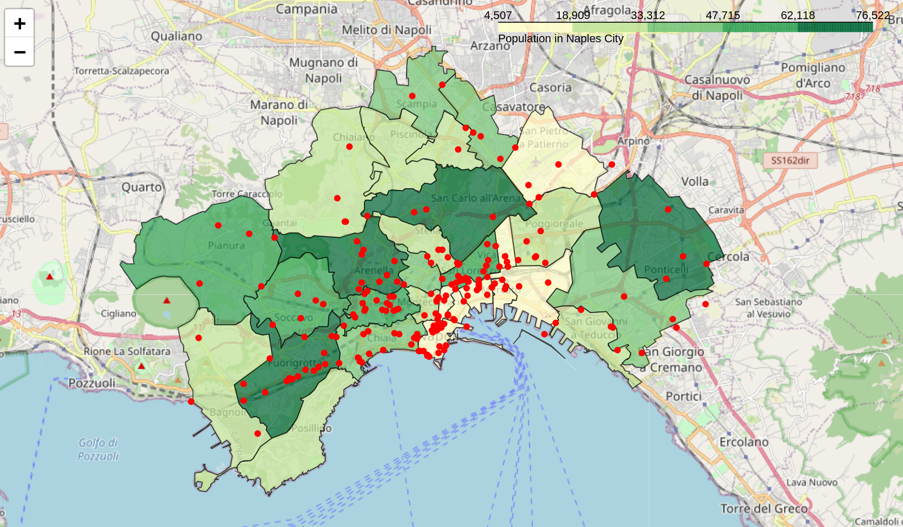

# Opening a new pizzeria in Naples? Use Machine Learning to know where!
## 1. Introduction
### 1.1 Background
One of the most popular meal in the world. Someone says that it comes from Turkey, others from Italy. Pizza has radically changed the world, in particular in Naples, the city considered as the birthplace of that disc of dough with tomato souce, mozarella and fresh basil. In the [Wikipedia Pizza page](https://en.wikipedia.org/wiki/Pizza) it can be found a fully description on the history, ingredients and way of cooking. Furthermore, many variants are present, like neapolitan or roman style.  
In this project we want to give an overview of the different borough of Naples, and analyze the optimal place for opening a new pizzeria. We will see that same area of Naples are full of pizzeria, and so a detailed analysis is needed. Furthermore, we will analyze insight from top pizzeria in Napoli, for example if they have public facebook, instagram page and so on. We all now that nowadays, the success of a venue is partially done to how much it is invested in marketing, and so sponsorizing what you do and your products is the key.  

<p align="center">

</p>
<p align="center">
Pizza margherita in its beautiness.
</p>

Lets now talk about the city of Naples. Accordingly to Wikipedia, Naples is the the third city in Italy for number of people, with almost one million of residents. It is the capital of Campania region and it is one of the most important cultural center all over the Italy. The city is mainly divided in 10 municipalities, with in total 30 boroughs.


<p align="center">

</p>


## 2. Data and resources
### 2.1 Data
Data that will be used in the analysis come from  different sources.
- **geographical information**: Naples division in borough is scraped from Wikipedia (link [here](https://it.wikipedia.org/wiki/Quartieri_di_Napoli)) using the basic function `read_html` from `pandas` library and their coordinates are obtained using `geopy` library;

- **demographical information**: number of residents per borough are scraped from Wikipedia (link [here](https://it.wikipedia.org/wiki/Municipalit%C3%A0_di_Napoli)) using the same function shown above;

<p align="center">

</p>

- **borough boundaries**: zip file from the official website of Naples townhall is downloaded, containing the data of borough's boundaries (link [here](http://www.comune.napoli.it/flex/cm/pages/ServeBLOB.php/L/IT/IDPagina/29771)). Since downloaded format is not ready-to-use, it is performed a little of data manipulation using `geopandas` library;  

- **venues**: this project provides the use of Foursquare API (some details [here](https://developer.foursquare.com/)) for obtaining all venues in the city of Naples, and in particular pizzerias. We will use different APIs for getting venues and details (rating, social page, number of tips etc.);



<p align="center">
A choroplet map based on population. In red, pizzeria venues.
</p>

Since there are some limitation in using free version of Foursquare API (like limit venues for each call, maximum 50 per call), using only boroughs coordinates as center could exclude some venues. So 50 random points have been samples from each borough. After, duplicates have been removed.

```python
def generate_random(number, polygon):
    list_of_points = []
    minx, miny, maxx, maxy = polygon.bounds
    counter = 0
    while counter < number:
        pnt = Point(random.uniform(minx, maxx), random.uniform(miny, maxy))
        if polygon.contains(pnt):
            list_of_points.append(pnt)
            counter += 1
    return list_of_points
```
<p align="center">
Defined function for sampling into borough.
</p>


### 2.2 Resources
Many resources have been used in order to scrape, download and do data manipulation:

- `pandas`: as already mentioned above, this library is very usefull for scraping data from web-site where there is a tabular form (in this case there is no needing to use specific web-scraping libraries);

- `numpy`: useful for feature engineering (like one-hot encoding);

- `sklearn`: best library for machine learning. There are nice distance-based clustering algorithms like k-means or DBSCAN. Since the scope is to clusterize boroughs based on their similarity, it is what we need;

- `folium`: one of the most used library for geoplotting. It allows high flexibility and customization, for plotting markers and choroplet map.


## 3. Analysis

### 3.1 Exploratory data analysis (EDA)
In this phase some EDA has been performed. For example, here are the first five boroughs for number of pizzeria:

<p align="center">

</p>

Clearly it has to be considered also the number of residents and the dimension of the boroughs.  
Having a look on the top 3 venue list for each borough, here's what we obtain:

<p align="center">

</p>

As we can see, pizzeria are very frequent (in 24 boroughs on 30, the pizzeria is in the list of top 3 most frequent venue).  

Looking for top 5 pizzeria based on their rating ranking, this is what you get:

<p align="center">

</p>

### 3.2 Data preparation and feature engineering
The data used for train the model are obtained pivoting the nearby dataframe, that contains venues near each pizzeria. So the data are grouped counting on each pizzeria how many venue of a specific category have been found in a neighborhood of 500 meters.

<p align="center">

</p>

For example, the venue in the third row has 3 bar in its neighborhood. The algorithm will clusterize pizzeria based on what there is in their neighborhood.


### 3.3 Clustering
For detecting the best place where opening a new pizzeria, we use k-means algorithm, that is a clustering distance-based method that will help to clusterize similar places.  
K-means algorithm creates sphere-like clusters, minimizing dissimilarity between them. Since the number of clusters (k) is unknown, the algorithm is trained with different k and evaluation is be performed using both elbow and silhouette methods.

<p align="center">

</p>

As it is possible to see, it is difficult to apply elbow method, since there isn't a distinct k where the distortion curve shows a rapid change. Using silhouette method, we are going to choose k = 9, since it is maximizing the similarity between clusters and their points.  
After clusterized, we can see the boxplot of clusters on rating score.

<p align="center">

</p>

Taking the median as the measure of clusters, we can clearly see that cluster 5 has the highest value.

<p align="center">

</p>

Lets plot everything on a map.


<p align="center">

</p>

The area with the highest score is Montecalvario (cluter 5).


### 3.4 Prediction
We are now going to predict values from the trained model. Data points will be sampled from each borough, and venues in their neighborhood will be retrieved using Foursquare. We are going to predict if there are similar area to the one with the highest score.

<p align="center">

</p>

There are lots of area similar to Montecalvario, in terms of venues.


## 4. Conclusion
With this report, we analyzed the venues in the city of Naples and found the optimal area where to open a new pizzeria. We have done this analysing the similarity between the different pizzeria in terms of nearby venues, clusterizing them and calculating the median rating score.  
A weak point in this analysis is the use of Foursquare API. We all know that, nowadays, one of the most used app for tips and ratings is Tripadvisor, that unfortunately cannot be use for non-commercial use. But with this study, we give an idea of what can be done with machine learning, even find a place where open a new pizzeria. This can be generalized for opening bar, pub and also restaurants.
